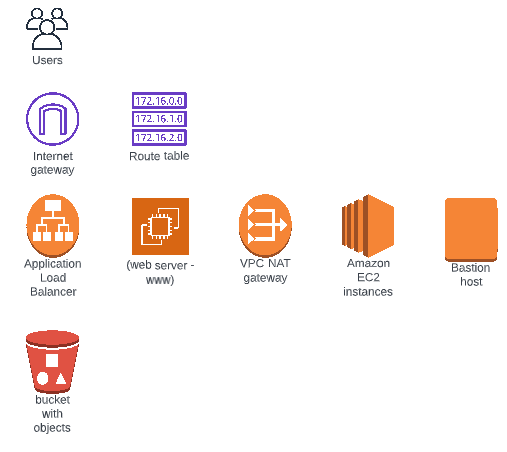

# [Udacity Cloud DevOps Engineering Project 2: Deploy a high-availability web app using CloudFormation](https://www.udacity.com/course/cloud-dev-ops-nanodegree--nd9991)


# Criteria


# Infrastructure Diagram 
AWS Architecture 2019

## Sequenced Infrastructure Diagram


### Key
#### Groups


#### Icons


# Run Solution (from root folder)
## String Parameters
### Create
```shell
sh shell-scripts/stack-create.sh parameter-stack solution/parameters.yml
```

### Update
```shell
sh shell-scripts/stack-update.sh parameter-stack solution/parameters.yml
```

### Delete
```shell
sh shell-scripts/stack-delete.sh parameter-stack
```

### List
```shell
sh shell-scripts/parameters-get-name-values "VirtualServerImageId"
```

```shell
sh shell-scripts/parameters-describe-all
```

## Network
### Create
```shell
sh shell-scripts/stack-create.sh network-stack solution/network.yml
```
### Update
```shell
sh shell-scripts/stack-update.sh network-stack solution/network.yml
```

### Delete
```shell
sh shell-scripts/stack-delete.sh network-stack
```

## Server
### Create
```shell
sh shell-scripts/stack-create.sh server-stack solution/server.yml
```
### Update
```shell
sh shell-scripts/stack-update.sh server-stack solution/server.yml
```

### Delete
```shell
sh shell-scripts/stack-delete.sh server-stack
```

## Other
```shell
sh shell-scripts/stacks-list-all.sh
```
